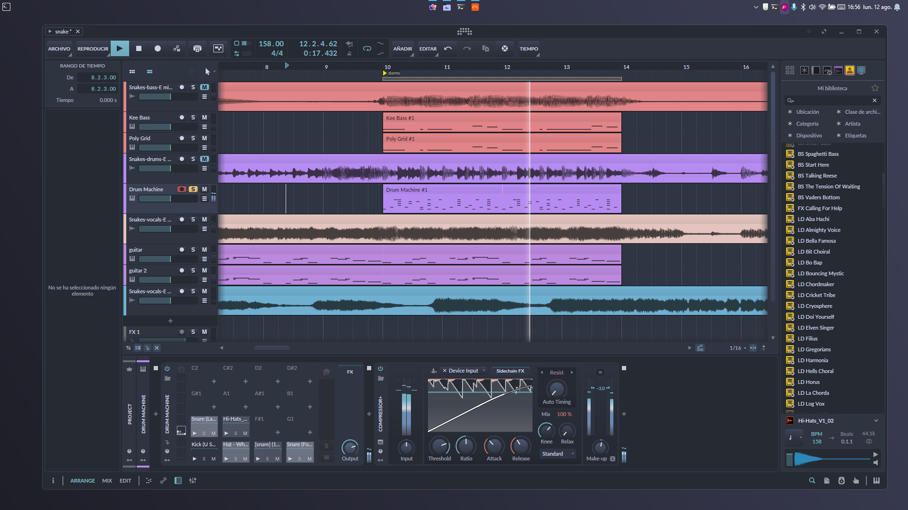
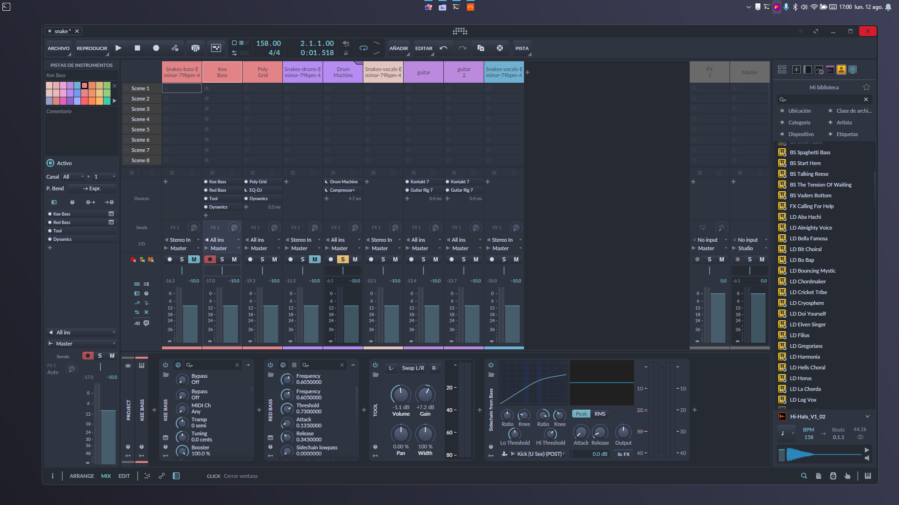
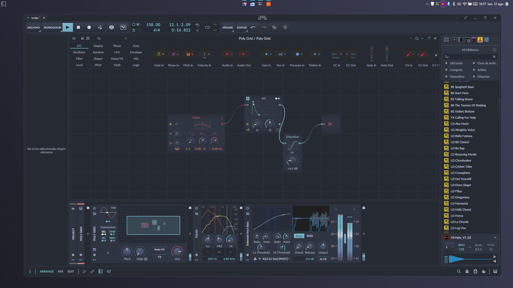
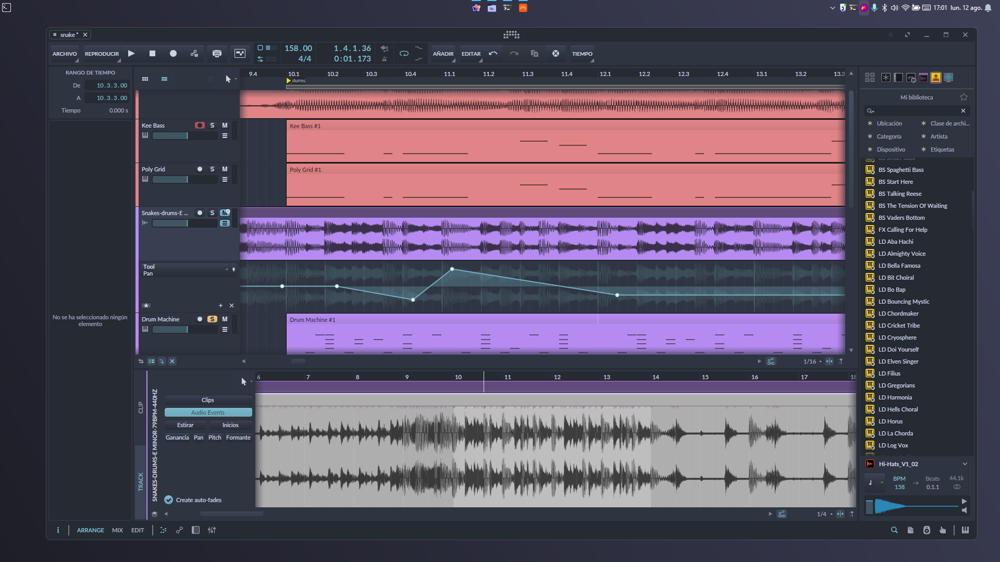

# Nord_BitwigTheme
Este tema esta inspirado en la paletta de colores [Nord](https://www.nordtheme.com/docs/colors-and-palettes)

# Instalacion 
- Siga los pasos recomendados por [Berikai](https://github.com/Berikai/bitwig-theme-editor.git)
- Descargue el archivo [`Nord.json`](Nord.json)
- De manera **opcional** puede usar la paleta de colores que se encuentra en la carpeta `palette`

# Capturas
Configuracion de las capturas en bitwig
- Medios tonos: 10%
- Nivel de negro: 80%
- Lineas de la rejilla: 10%
  

